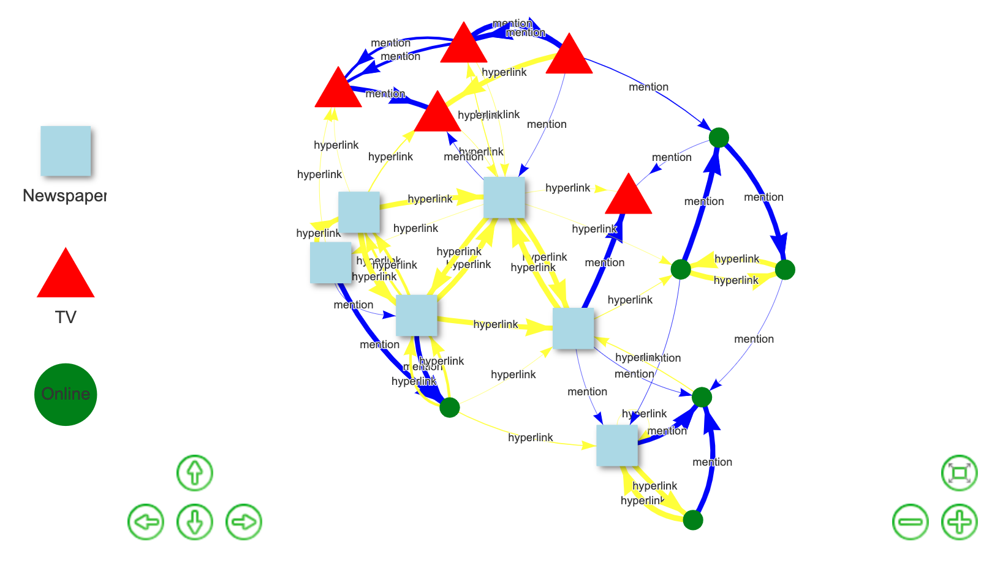

# Interactive Network Visualization

In this project I use `visNetwork` package for interactive network visualization. 
This package use piping, similar to `tidygraph`.
This package allows us to create a visualization that can be modified, moved, rotated, etc. after the visualization has been rendered.

For more detail about interactive features of the visualization, check [here](https://www.rpubs.com/Steven_Surya/visNetwork)
